**Scenario**

The café currently uses a single Amazon Elastic Compute Cloud (Amazon
EC2) instance to host its web server, database, and application code.

Meanwhile, the café business has grown. The order history that is stored
in the database provides valuable business information that the café
staff doesn't want to lose. Martha uses the data for accounting, and
Frank looks at it occasionally to plan how many of each dessert type he
should bake.

Sofía has additional concerns. The database must be consistently
upgraded and patched, and she doesn’t always have time to do these
tasks.Also, administering the database is a specialized skill. Training
others to do database administration isn’t something that she wants to
spend time on. Meanwhile, Sofía is also concerned that the café isn’t
doing data backups as often as they should.

Finally, Martha also wants to reduce labour costs that are associated
with the technical learning investment that's needed to manage the
database.

> • Create an RDS database instance.
>
> • Export data from a MariaDB database by using mysqldump.
>
> • Connect a SQL client to an RDS database.
>
> • Migrate data from a MariaDB database that runs on an EC2 instance to
> an RDS database instance.
>
> • Configure a web application to use the new RDS database instance for
> data storage

**Screenshots**
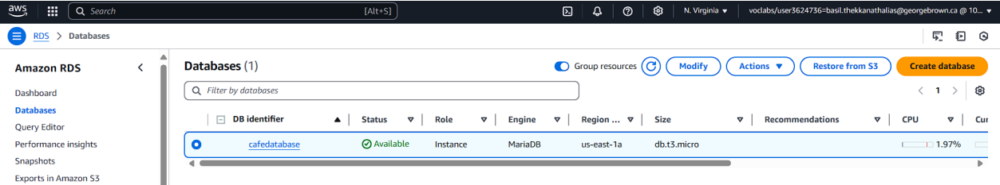
*Created* *a* *database* *instance* *under* *Amazon* *RDS*

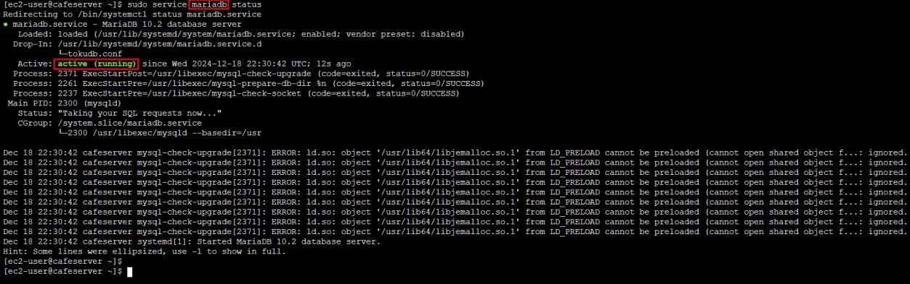

*Checking* *the* *status* *of* *MariaDB* *inside* *EC2* *instance*

*Webpage* *details*

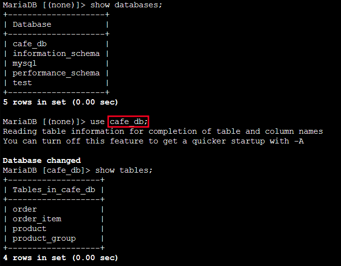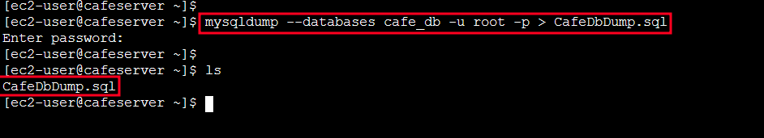

*Reviewing* *Databases* *and* *checking* *the* *tables* *inside* *of*
*café_db*

*Taking* *backup* *of* *the* *café_db* *database*

*Modifying* *inbound* *rule* *to* *allow* *port* *3306* *and* *giving*
*source* *as* *security* *group* *of* *EC2* *instance*

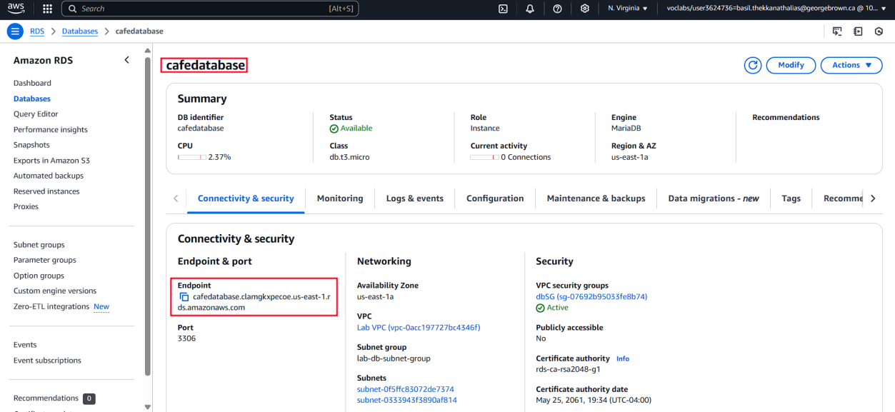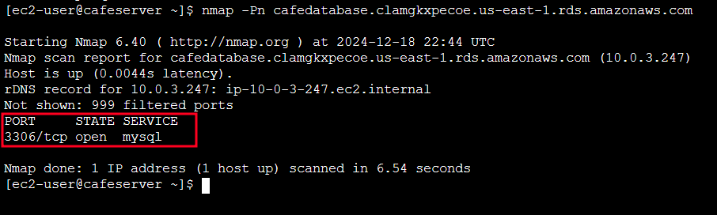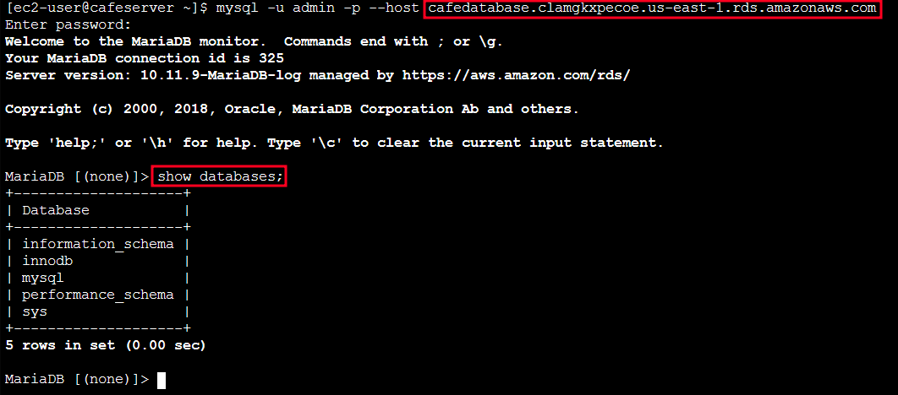

*Copying* *endpoint* *of* *RDS* *database*

*3306* *port* *is* *open*

*Connecting* *to* *RDS* *database* *and* *reviewing* *the* *available*
*databases*

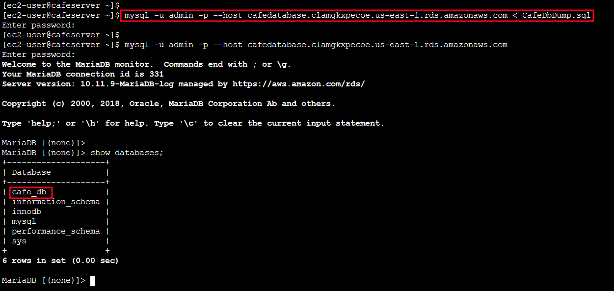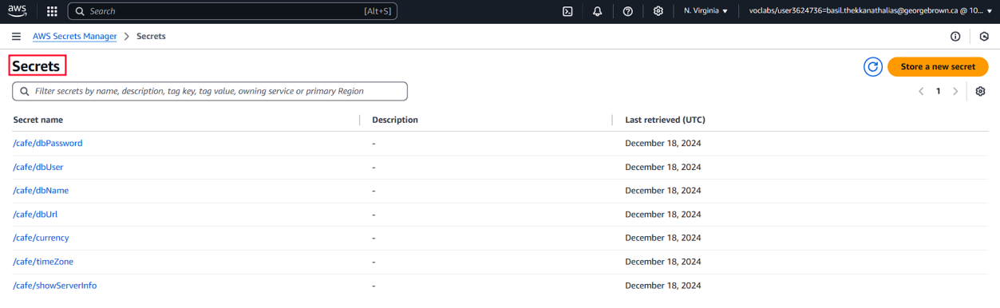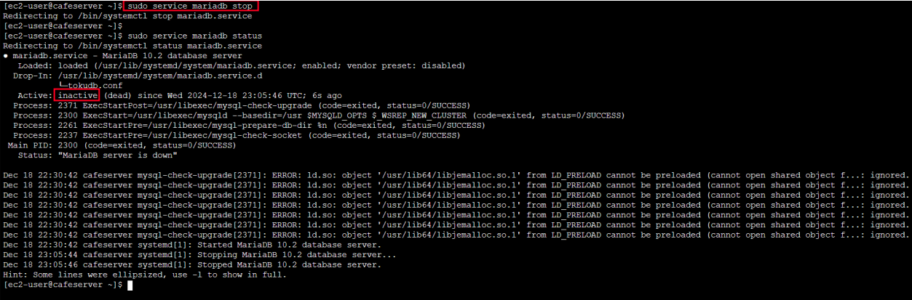

*Importing* *the* *Café_db* *backup* *to* *RDS* *Database*

*Secrets* *Manager* *details*

*Stopping* *the* *MariaDB* *service* *inside* *the* *EC2* *instance*

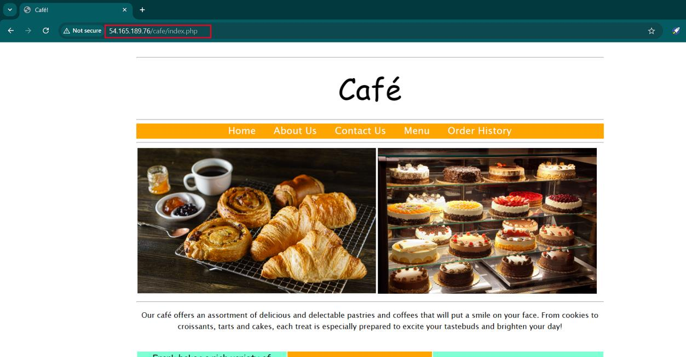

*Accessing* *the* *webpage*

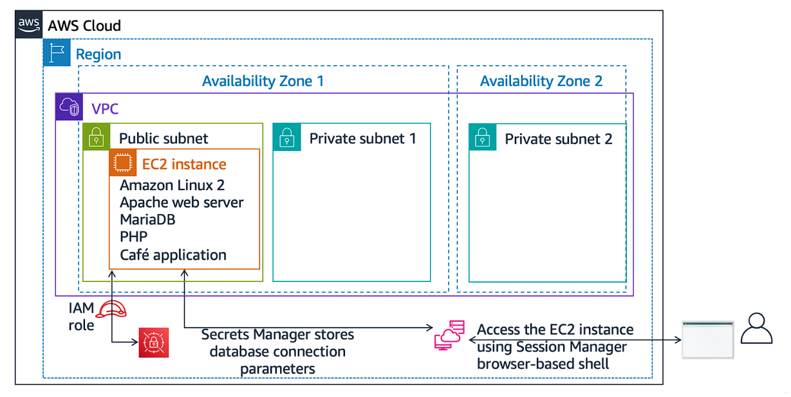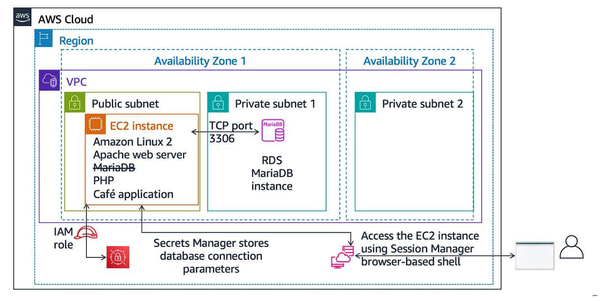

*Architecture* *details* *before* *migration*

*Architecture* *details* *after* *migration*

**Conclusion**

> • Created an RDS database instance
>
> • Exported data from a MariaDB database by using mysqldump
>
> • Connected a SQL client to an RDS database.
>
> • Migrated data from a MariaDB database that runs on an EC2 instance
> to an RDS database instance
>
> • Configured a web application to use the new RDS database instance
> for data storage
